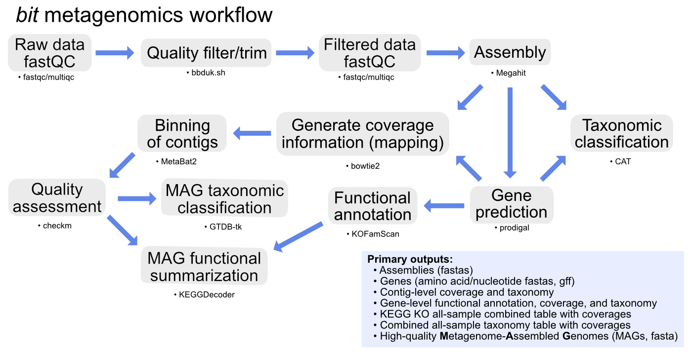

# [bit](https://github.com/AstrobioMike/bit) metagenomics workflow
This is a [snakemake](https://snakemake.github.io/) workflow for short-read metagenomics data. It processes via an assembly-based approach through to merged taxonomy and KO coverage tables, as well as recovering and characterizing MAGs. For all workflows available with _bit_, see [here](https://github.com/AstrobioMike/bit?tab=readme-ov-file#workflows).

---

* [**Overview**](#overview)
* [**Usage**](#usage)
  * [Retrieving the workflow](#retrieving-the-workflow)
  * [Creating the input file and modifying the config.yaml](#creating-the-input-file-and-modifying-the-configyaml)
  * [Running the workflow](#running-the-workflow)
* [**Version info**](#version-info)

---

## Overview

<p align="center">
<a href="../../images/bit-metagenomics-overview.pdf"></a>
</p>

This workflow perform an assembly-based approach to ultimately recover taxonomic and KO coverage tables across all samples, as well as attempt to recover and characterize bacterial/archaeal MAGs. It currently only assembles individual samples, and does not perform any co-assembly.

  - [fastqc](https://www.bioinformatics.babraham.ac.uk/projects/fastqc/)/[multiqc](https://multiqc.info/) for read-quality assessment and summarization
  - [bbmap/bbduk](https://jgi.doe.gov/data-and-tools/software-tools/bbtools/bb-tools-user-guide/bbduk-guide/) for read quality-filtering and trimming
  - [megahit](https://github.com/voutcn/megahit) for assembly
  - [prodigal](https://github.com/hyattpd/Prodigal) for gene prediction
  - [bowtie2](https://github.com/BenLangmead/bowtie2) for read mapping
  - [KOFamScan](https://github.com/takaram/kofam_scan) for functional annotation
  - [CAT](https://github.com/dutilh/CAT#cat-and-bat) with the NCBI nr database for contig and gene taxonomic assignment
  - [metabat2](https://bitbucket.org/berkeleylab/metabat/src) for binning of contigs
  - [checkm2](https://github.com/chklovski/CheckM2#checkm2) for estimating quality of bacterial/archaeal bins
  - [GTDB-tk](https://github.com/Ecogenomics/GTDBTk#gtdb-tk) for assigning taxonomy of bacterial/archaeal MAGs ("MAGs" defined by cutoffs in config.yaml)
  - [KEGG-decoder](https://github.com/bjtully/BioData/tree/master/KEGGDecoder) for functionally summarizing recovered MAGs

All required databases will be setup by the workflow if they don't exist already whenever they are used for the first time.

---

## Usage
_bit_ should be installed via conda as described [here](https://github.com/AstrobioMike/bit?tab=readme-ov-file#conda-install).

### Retrieving the worklfow

```bash
bit-get-workflow metagenomics
```

### Creating the input file and modifying the config.yaml
Before running it, you first need to make a file holding unique portions of the filenames for all input samples, one per line in a single-column. And some variables need to be set in the config.yaml.

The primary things that need to be set in the config.yaml are designated in the first block of the config.yaml, these include things like: the unique sample ID file mentioned just above; where the input reads are located; their expected suffix; and where the reference databases are (or should be put if this is the first time running the workflow).

There are many other options/settings that can be changed if wanted, all described in the config.yaml.

### Running the workflow
After variables are set in the config.yaml, here's an example of how it could be run (note that it should still be run inside the _bit_ conda environment):
 
```bash
snakemake --use-conda --conda-prefix ${CONDA_PREFIX}/envs -j 4 -p
```

- `--use-conda` – this specifies to use the conda environments included in the workflow
- `--conda-prefix` – this allows us to point to where the needed conda environments should be stored. Including this means if we use the workflow on a different dataset somewhere else in the future, it will re-use the same conda environments rather than make new ones. The value listed here, `${CONDA_PREFIX}/envs`, is the default location for conda environments (the variable `${CONDA_PREFIX}` will be expanded to the appropriate location on whichever system it is run on).
- `-j` – this lets us set how many jobs Snakemake should run concurrently (keep in mind that many of the thread and cpu parameters set in the config.yaml file will be multiplied by this)
- `-p` – specifies to print out each command being run to the screen

See `snakemake -h` for more options and details.

---

## Version info
Note that the workflows are version independently of the _bit_ package. When you pull one with `bit-get-workflow`, the directory name will have the version, and it is also listed at the top of the Snakefile.

All versions of programs used can be found in their corresponding conda yaml file in the envs/ directory. 
